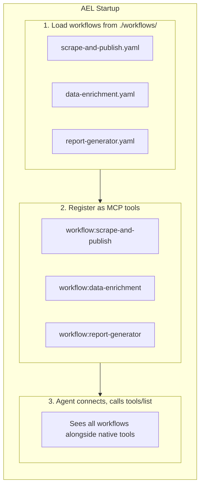
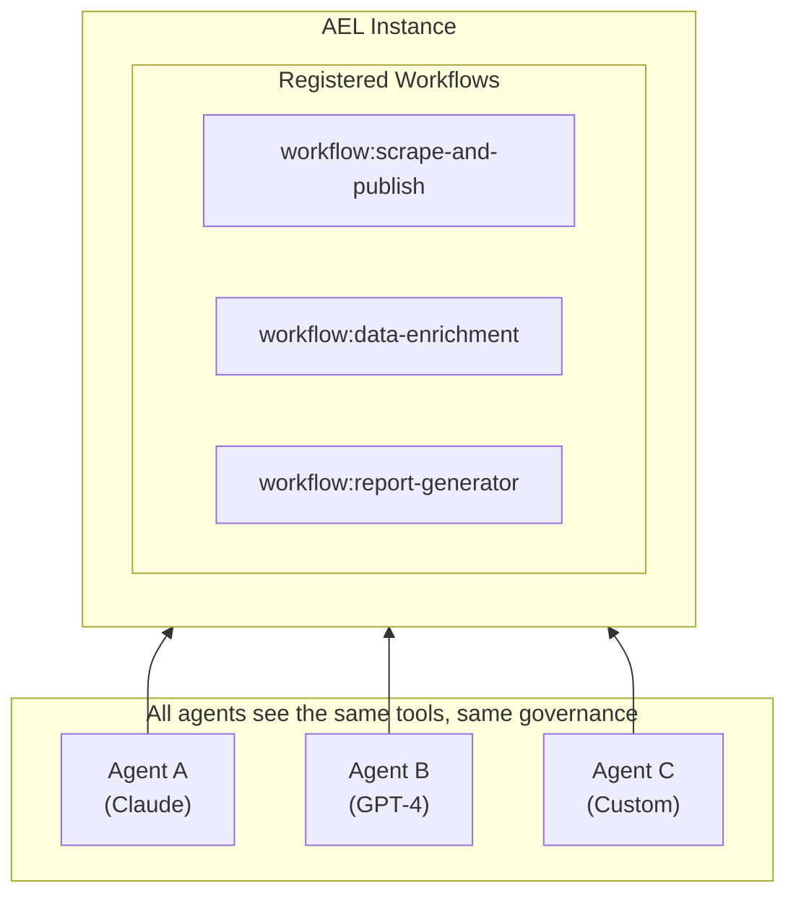

# Workflows as Tools

Every AEL workflow automatically becomes an MCP tool. Agents call workflows like any other tool—no special integration required.

This is AEL's core differentiator: **workflows are first-class MCP citizens**.

---

## The Concept

When AEL starts:
1. Workflows are loaded from the configured directory
2. Each workflow is registered as an MCP tool
3. Agents discover workflows via standard MCP `tools/list`
4. Agents call workflows via standard MCP `tools/call`



---

## Why This Matters

### 1. Stable Agent Interfaces

Workflow names don't change. The underlying implementation can evolve without breaking agent prompts.

```
# Agent prompt (stable)
"Use workflow:data-pipeline to process the data"

# Workflow implementation (can change)
v1.0: fetch → transform → save
v2.0: fetch → validate → transform → cache → save
```

### 2. Reduced Prompt Complexity

One tool call instead of many. Agents don't need to know the steps.

```
# Without AEL: Agent must orchestrate
"First call firecrawl_scrape, then transform the result, then call kafka_publish..."

# With AEL: Single tool
"Call workflow:scrape-and-publish with the URL"
```

### 3. Enforced Execution Boundaries

Workflows define exactly what can happen. Agents can't deviate.

```yaml
# This workflow can ONLY do these three things
steps:
  - id: fetch
    tool: firecrawl_scrape    # ✅ Allowed
  - id: transform
    code: |                   # ✅ Allowed (sandboxed)
      ...
  - id: publish
    tool: kafka_produce       # ✅ Allowed

# Agent cannot call other tools through this workflow
```

### 4. Multi-Agent Cooperation

Multiple agents can share the same AEL instance. All agents see the same workflows.



---

## How It Works

### Tool Naming Convention

All workflows use the `workflow:` prefix:

```
workflow:scrape-and-publish
workflow:data-enrichment
workflow:report-generator
```

**Why the prefix?**
- **Disambiguation** — Clear distinction from native tools
- **Grouping** — Easy to filter workflow tools
- **No collision** — Workflow can have same base name as native tool

### From Workflow to Tool

**Workflow definition:**

```yaml
name: scrape-and-publish
version: "1.0.0"
description: "Scrape a URL and publish content to Kafka"

inputs:
  - url:
      type: string
      required: true
      description: "URL to scrape"
  - topic:
      type: string
      required: true
      description: "Kafka topic to publish to"
  - format:
      type: string
      default: "markdown"
      enum: ["markdown", "html"]

steps:
  - id: fetch
    tool: firecrawl_scrape
    params:
      url: "{{ inputs.url }}"
      format: "{{ inputs.format }}"
      
  - id: transform
    code: |
      data = context.steps['fetch'].output
      return {"content": data['content'], "url": context.inputs['url']}
      
  - id: publish
    tool: kafka_produce
    params:
      topic: "{{ inputs.topic }}"
      message: "{{ steps.transform.output }}"

outputs:
  - name: result
    from_path: steps.publish.output
    description: "Kafka publish result"
```

**Generated MCP tool:**

```json
{
  "name": "workflow:scrape-and-publish",
  "description": "Scrape a URL and publish content to Kafka",
  "inputSchema": {
    "type": "object",
    "properties": {
      "url": {
        "type": "string",
        "description": "URL to scrape"
      },
      "topic": {
        "type": "string",
        "description": "Kafka topic to publish to"
      },
      "format": {
        "type": "string",
        "enum": ["markdown", "html"],
        "default": "markdown"
      }
    },
    "required": ["url", "topic"]
  }
}
```

### Agent Discovery

Agents discover workflows via standard MCP:

```json
// tools/list response
{
  "tools": [
    // Native tools
    {"name": "firecrawl_scrape", "description": "..."},
    {"name": "kafka_produce", "description": "..."},
    
    // Workflow tools (clearly distinguished by prefix)
    {"name": "workflow:scrape-and-publish", "description": "..."},
    {"name": "workflow:data-enrichment", "description": "..."}
  ]
}
```

### Agent Invocation

Agents call workflows like any tool:

```json
// tools/call request
{
  "name": "workflow:scrape-and-publish",
  "arguments": {
    "url": "https://example.com/article",
    "topic": "content-updates"
  }
}
```

### Response Format

```json
// tools/call response
{
  "content": [
    {
      "type": "text",
      "text": "{\"result\": {\"partition\": 0, \"offset\": 12345}}"
    }
  ],
  "_meta": {
    "execution_id": "exec-abc123",
    "workflow_id": "scrape-and-publish",
    "workflow_version": "1.0.0",
    "duration_ms": 5230
  }
}
```

---

## Error Handling

When a workflow fails, the response includes structured error information:

```json
{
  "content": [
    {
      "type": "text",
      "text": "Tool 'firecrawl_scrape' is unavailable: Connection refused"
    }
  ],
  "isError": true,
  "_meta": {
    "execution_id": "exec-abc123",
    "error": {
      "code": "TOOL_UNAVAILABLE",
      "category": "TOOL",
      "message": "Tool 'firecrawl_scrape' is unavailable",
      "step_id": "fetch",
      "retryable": true
    }
  }
}
```

Agents can use the `retryable` flag to decide whether to retry.

---

## What's NOT Implemented Yet

| Feature | Status | Phase |
|---------|--------|-------|
| **Workflow composition** (workflows calling workflows) | Planned | Enterprise |
| **Version pinning** (`workflow:name@1.2.0`) | Planned | Enterprise |
| **Per-workflow exposure control** | Planned | Enterprise |
| **Partial results on failure** | Planned | Enterprise |

**[See Roadmap →](../roadmap.md)**

---

## Next Steps

- **[How AEL Works](./how-ael-works.md)** — The planning vs execution separation
- **[Execution Model](./execution-model.md)** — How workflows execute
- **[Workflow Schema](../reference/workflow-schema.md)** — Complete YAML reference

**← [Security Model](./security-model.md)** | **[Workflow Schema →](../reference/workflow-schema.md)**
