# Web Scraping Example

This example demonstrates fetching and processing web content.

## Overview

This workflow:
1. Fetches a webpage using HTTP
2. Extracts specific data
3. Formats the output

## Prerequisites

- MCP server with fetch tool (e.g., `@modelcontextprotocol/server-fetch`)
- Ploston configured with the MCP server

## Configuration

```yaml
# ael-config.yaml
tools:
  mcp_servers:
    fetch:
      command: npx
      args: ["-y", "@modelcontextprotocol/server-fetch"]
```

## Workflow

```yaml
# workflows/web-scrape.yaml
name: web-scrape
version: "1.0"
description: Fetch and extract data from a webpage

inputs:
  url:
    type: string
    description: URL to fetch
  selector:
    type: string
    default: "title"
    description: CSS selector or element to extract

steps:
  - id: fetch
    tool: fetch
    params:
      url: "{{ inputs.url }}"
    timeout: 60
    on_error: fail

  - id: extract
    depends_on: [fetch]
    code: |
      import re
      
      content = "{{ steps.fetch.output }}"
      selector = "{{ inputs.selector }}"
      
      # Simple extraction (for demo - use proper HTML parser in production)
      if selector == "title":
          match = re.search(r'<title>(.*?)</title>', content, re.IGNORECASE)
          result = match.group(1) if match else "No title found"
      else:
          # Extract text between tags
          pattern = f'<{selector}[^>]*>(.*?)</{selector}>'
          matches = re.findall(pattern, content, re.IGNORECASE | re.DOTALL)
          result = matches if matches else []

  - id: format
    depends_on: [extract]
    code: |
      import json
      
      data = {{ steps.extract.output }}
      result = {
          "url": "{{ inputs.url }}",
          "selector": "{{ inputs.selector }}",
          "extracted": data
      }

output: "{{ steps.format.output }}"
```

## Running the Workflow

### Validate

```bash
ploston validate workflows/web-scrape.yaml
```

### Run

```bash
ploston run workflows/web-scrape.yaml \
  -i url="https://example.com" \
  -i selector="title"
```

### Expected Output

```json
{
  "url": "https://example.com",
  "selector": "title",
  "extracted": "Example Domain"
}
```

## Variations

### Extract Multiple Elements

```yaml
steps:
  - id: extract_all
    depends_on: [fetch]
    code: |
      import re
      
      content = "{{ steps.fetch.output }}"
      
      # Extract all links
      links = re.findall(r'href="([^"]+)"', content)
      
      # Extract all headings
      h1s = re.findall(r'<h1[^>]*>(.*?)</h1>', content, re.IGNORECASE)
      h2s = re.findall(r'<h2[^>]*>(.*?)</h2>', content, re.IGNORECASE)
      
      result = {
          "links": links[:10],  # First 10 links
          "h1": h1s,
          "h2": h2s
      }
```

### With Error Handling

```yaml
steps:
  - id: fetch
    tool: fetch
    params:
      url: "{{ inputs.url }}"
    timeout: 60
    on_error: retry
    retry:
      max_attempts: 3
      initial_delay: 2.0
      backoff_multiplier: 2.0

  - id: validate
    depends_on: [fetch]
    code: |
      content = "{{ steps.fetch.output }}"
      
      if not content or len(content) < 100:
          raise ValueError("Page content too short or empty")
      
      result = {"valid": True, "length": len(content)}
```

## Best Practices

1. **Set appropriate timeouts** - Web requests can be slow
2. **Use retry for transient failures** - Network issues are common
3. **Validate responses** - Check content before processing
4. **Limit extracted data** - Do not return entire pages
5. **Handle encoding** - Web content may have various encodings

## Calling from Claude Desktop

### Without Ploston: what the agent has to do

If the agent tried to orchestrate this itself — scraping a site and taking action on every result — it would need to issue dozens or hundreds of tool calls, passing every result back through the LLM. The context window fills up, tokens explode, and the task fails:



### With Ploston: one call does it all

Once the workflow is registered with the Control Plane, Claude can call it as a single MCP tool:



1. Copy `web-scrape.yaml` to your workflows directory and verify it's registered:

```bash
cp web-scrape.yaml ~/my-workflows/
ploston workflows list
# web-scrape   ✓
```

2. Restart Claude Desktop (tool lists are loaded at startup).

3. Ask Claude:

> "Use the web-scrape workflow to fetch https://example.com and extract the title"

Claude calls `w_web-scrape` — one MCP invocation. Ploston runs fetch → extract → format deterministically and returns the result. No intermediate LLM reasoning, no token explosion.

```
Claude Desktop
    │
    │  tools/call  w_web-scrape
    │  { "url": "https://example.com", "selector": "title" }
    ▼
Ploston
    ├── fetch    http_request  (or firecrawl_search)  ✓
    ├── extract  code step                             ✓
    └── format   code step                             ✓
    ▼
{ "url": "...", "selector": "title", "extracted": "Example Domain" }
```

## Related

- [First Workflow Tutorial](../getting-started/first-workflow.md)
- [Data Processing Example](data-processing.md)
- [API Integration Example](api-integration.md)
- [Workflow Authoring Guide](../guides/workflow-authoring.md)
