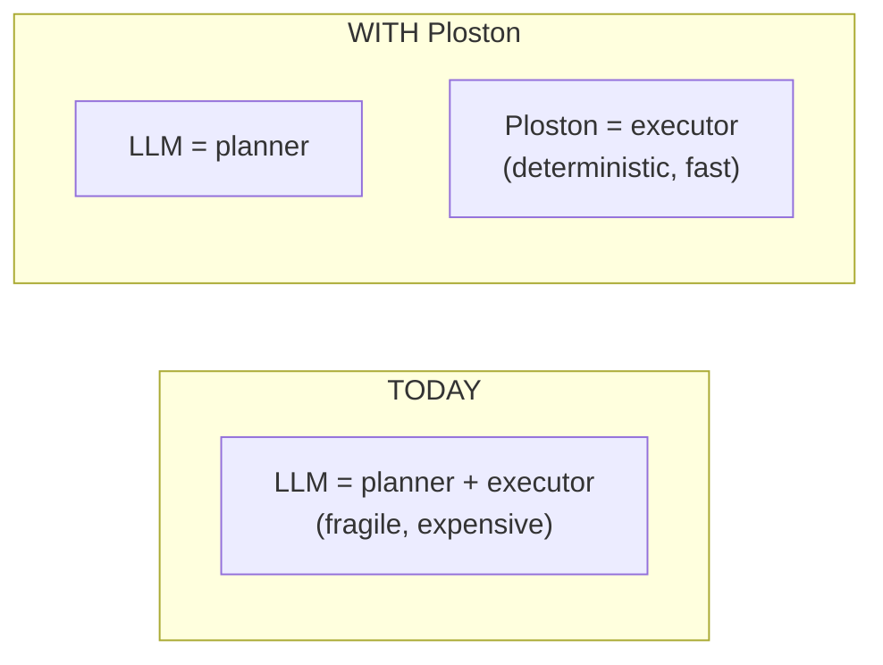
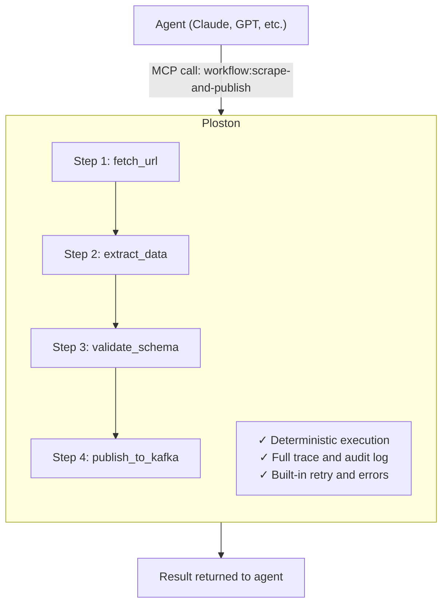
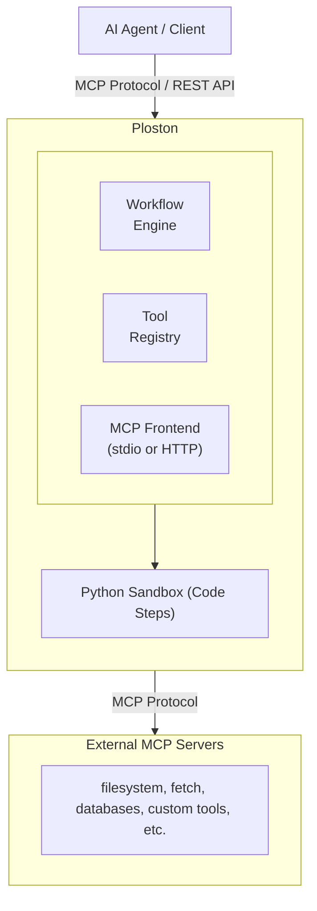

# Ploston

**LLM plans. Ploston executes.**

---

## The Problem

Today's AI agents orchestrate their own tool calls. The LLM decides which tool to call, interprets the result, decides the next step, and repeats—burning tokens and hallucinating along the way.

This creates five systemic failures:

| Failure | What Happens |
|---------|--------------|
| **Unreliable** | LLMs hallucinate steps, misuse tools, forget context mid-chain |
| **Expensive** | Every action requires another LLM round-trip. Multi-step tasks explode in cost. |
| **Non-deterministic** | Same request produces different behavior. Impossible to test or guarantee. |
| **Opaque** | No audit trail. Just a blob of reasoning you can't inspect or replay. |
| **Ungovernable** | No policy enforcement. No compliance. No safety guarantees. |

No enterprise will deploy this in production. No developer wants to debug it.

---

## The Solution

Ploston moves orchestration out of the LLM and into a deterministic runtime.



You define workflows in YAML. Ploston exposes them as MCP tools. When your agent needs to scrape a website, transform the data, and publish it—it makes **one call** to your workflow. Ploston handles the rest.

Same inputs. Same outputs. Every time.

---

## How It Works



*The ✓ marks indicate guarantees Ploston provides: deterministic execution (same inputs → same outputs), complete audit trails, and automatic retry/error handling.*

The agent doesn't orchestrate. It delegates to infrastructure that executes reliably.

**[Learn how this works →](concepts/how-ploston-works.md)**

---

## Quick Start

```bash
# Install the CLI
pip install ploston-cli

# Run a workflow
ploston run workflows/hello-world.yaml

# Start as MCP server (connect to Claude Desktop)
ploston serve
```

**[Get Started →](getting-started/installation.md)**

---

## What You Get

### OSS (Available Now)

- **Workflow Engine** — YAML-defined, deterministic execution
- **MCP Native** — Expose workflows as tools agents can call
- **Python Code Steps** — Sandboxed execution with 7-layer security
- **CLI** — Manage, test, and run workflows locally
- **Telemetry** — Execution traces and structured logging

### Enterprise (Coming Soon)

- **Governance** — RBAC, ABAC, policy enforcement
- **Advanced Workflows** — Parallel execution, human approval, compensation
- **Pattern Mining** — Detect repeated tool chains, suggest workflows
- **Workflow Synthesis** — LLM-generated workflows from observed patterns
- **Cost Accounting** — Track token savings, report ROI

**[See Roadmap →](roadmap.md)**

---

## Why Ploston?

Ploston is not an API gateway. It's not a workflow engine. It's not an agent framework.

It's the **execution layer** that makes agent systems production-ready.

**[Learn why this matters →](why-ploston.md)**

---

## Architecture



### Key Concepts

| Concept | Description |
|---------|-------------|
| **Workflow** | A YAML file defining a sequence of steps to execute |
| **Step** | Either a code step (Python) or a tool step (MCP tool call) |
| **MCP Server** | External service providing tools via Model Context Protocol |
| **Tool** | A function that can be called from workflows or by AI agents |

---

## Documentation

### Getting Started

| Guide | Description |
|-------|-------------|
| [Installation](getting-started/installation.md) | Install from source or Docker |
| [Quickstart](getting-started/quickstart.md) | 5-minute introduction to Ploston |
| [First Workflow](getting-started/first-workflow.md) | Step-by-step workflow tutorial |

### Concepts

| Concept | Description |
|---------|-------------|
| [How Ploston Works](concepts/how-ploston-works.md) | Core mental model: planning vs execution |
| [Execution Model](concepts/execution-model.md) | Step execution, data flow, error handling |
| [Security Model](concepts/security-model.md) | 7-layer sandbox security |
| [Workflows as Tools](concepts/workflows-as-tools.md) | Virtual tool publishing via MCP |

### Guides

| Guide | Description |
|-------|-------------|
| [Workflow Authoring](guides/workflow-authoring.md) | Complete guide to writing workflows |
| [Code Steps](guides/code-steps.md) | Using Python code in workflows |
| [Tool Integration](guides/tool-integration.md) | Connecting MCP tools |
| [Troubleshooting](guides/troubleshooting.md) | Common issues and solutions |

### Reference

| Reference | Description |
|-----------|-------------|
| [CLI Reference](reference/cli-reference.md) | All CLI commands and options |
| [Workflow Schema](reference/workflow-schema.md) | Complete YAML schema reference |
| [Configuration](reference/config-reference.md) | Configuration file options |
| [Error Codes](reference/error-codes.md) | Error codes and resolutions |

### Examples

| Example | Description |
|---------|-------------|
| [Web Scraping](examples/web-scraping.md) | Extract data from websites |
| [Data Processing](examples/data-processing.md) | Transform and process data |
| [API Integration](examples/api-integration.md) | Integrate with external APIs |

---

## System Requirements

- **Python**: 3.12 or higher
- **OS**: macOS, Linux, Windows
- **Memory**: 512MB minimum, 1GB recommended

---

## Getting Help

- **GitHub Issues**: [Report bugs or request features](https://github.com/ostanlabs/ploston/issues)
- **Discussions**: [Ask questions and share ideas](https://github.com/ostanlabs/ploston/discussions)

---

## License

Ploston is released under the [Apache 2.0 License](https://github.com/ostanlabs/ploston/blob/main/LICENSE).
