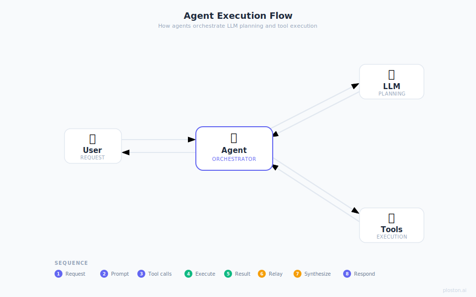

# Ploston

**LLMs plan. Ploston executes.**

Ploston is a deterministic execution layer for AI agents. You define multi-step workflows in YAML, Ploston exposes them as MCP tools, and your agent calls them with a single invocation.

---

## The problem

When an agent orchestrates its own tool calls, every intermediate result passes through the LLM. A 3-step task burns ~10,000 tokens. Run it twice and you may get different results. When something fails, you get a reasoning blob with no trace.



## The solution

Ploston moves orchestration out of the LLM. Same 3-step task: ~500 tokens. Same inputs → same outputs, every time. Full step-by-step trace.


**[Why this matters →](why-ploston.md)**

---

## Quick start

```bash
pip install ploston-cli       # install the CLI
ploston bootstrap             # deploy the Control Plane (Docker)
ploston init --import         # import your MCP tools, start local runner
# restart Claude Desktop
```

**[Full installation guide →](getting-started/installation.md)**

---

## How it works

```
┌──────────────┐  MCP (stdio/HTTP)  ┌───────────────────────────┐
│ Claude / any │ ◄────────────────► │  Ploston Control Plane    │
│  MCP client  │                    │  ┌──────────┐ ┌─────────┐ │
└──────────────┘                    │  │ Workflow │ │  Tool   │ │
                                    │  │ Engine   │ │Registry │ │
                                    │  └────┬─────┘ └────┬────┘ │
                                    └───────┼────────────┼──────┘
                                            │  WebSocket │
                                    ┌───────▼────────────▼──────┐
                                    │       Local Runner        │
                                    │  github, postgres, slack, │
                                    │  your custom MCP servers  │
                                    └───────────────────────────┘
```

**Control Plane** — workflow engine, MCP frontend, tool registry, REST API. Runs in Docker.

**Local Runner** — connects your local MCP servers to the CP over WebSocket. Your tools never leave your machine.

**Workflows** — YAML files. Once registered, appear as `w_<name>` MCP tools.

---

## Write a workflow

```yaml
name: page-report
version: "1.0.0"
description: "Fetch a URL and save a title report"

inputs:
  - name: url
    type: string

steps:
  - id: fetch
    tool: http_request
    params:
      url: "{{ inputs.url }}"
      method: GET

  - id: extract
    depends_on: [fetch]
    code: |
      import re
      body  = context.steps["fetch"].output.get("body", "")
      match = re.search(r"<title[^>]*>(.*?)</title>", body, re.IGNORECASE)
      result = {"title": match.group(1).strip() if match else "No title"}

  - id: save
    depends_on: [extract]
    tool: fs_write
    params:
      path: "report.txt"
      content: "Title: {{ steps.extract.output.title }}\n"

outputs:
  - name: title
    from: steps.extract.output.title
```

```bash
ploston validate page-report.yaml   # check it
ploston run page-report.yaml -i url=https://example.com   # test it
```

Claude can now call `w_page-report` as a single MCP tool.

**[First workflow tutorial →](getting-started/first-workflow.md)**

---

## What's included

| | OSS (available now) | Enterprise (planned) |
|---|---|---|
| Workflow engine | ✅ | ✅ |
| MCP integration | ✅ | ✅ |
| Python sandbox | ✅ | ✅ |
| CLI + REST API | ✅ | ✅ |
| Docker + K8s deploy | ✅ | ✅ |
| Prometheus + Grafana | ✅ | ✅ |
| RBAC / policy engine | — | Phase 4 |
| Parallel execution | — | Phase 4 |
| Pattern mining | — | Phase 5 |
| Workflow synthesis | — | Phase 5 |

**[Full roadmap →](roadmap.md)**

---

## Documentation

**Getting started**
→ [Installation](getting-started/installation.md) — deploy in 5 minutes
→ [Quickstart](getting-started/quickstart.md) — write and call your first workflow
→ [First Workflow Tutorial](getting-started/first-workflow.md) — step-by-step with tool calls

**Concepts**
→ [How Ploston Works](concepts/how-ploston-works.md) — planning vs execution separation
→ [Execution Model](concepts/execution-model.md) — steps, data flow, error handling
→ [Security Model](concepts/security-model.md) — 7-layer sandbox
→ [Workflows as Tools](concepts/workflows-as-tools.md) — MCP tool publishing

**Guides**
→ [Workflow Authoring](guides/workflow-authoring.md)
→ [Code Steps](guides/code-steps.md)
→ [Tool Integration](guides/tool-integration.md)
→ [Docker Deployment](guides/docker.md)
→ [Troubleshooting](guides/troubleshooting.md)

**Reference**
→ [CLI Reference](reference/cli-reference.md)
→ [Workflow Schema](reference/workflow-schema.md)
→ [Configuration](reference/config-reference.md)
→ [Error Codes](reference/error-codes.md)

---

## System requirements

- Python 3.12+
- Docker & Docker Compose v2.20+
- macOS, Linux, or Windows (WSL2)
- 2 GB RAM recommended

## License

[Apache 2.0](https://github.com/ostanlabs/ploston/blob/main/LICENSE)
