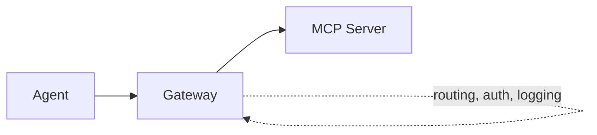
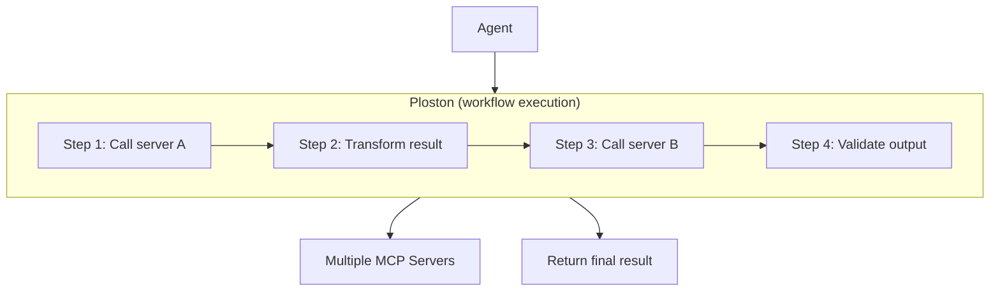
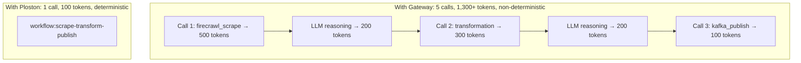
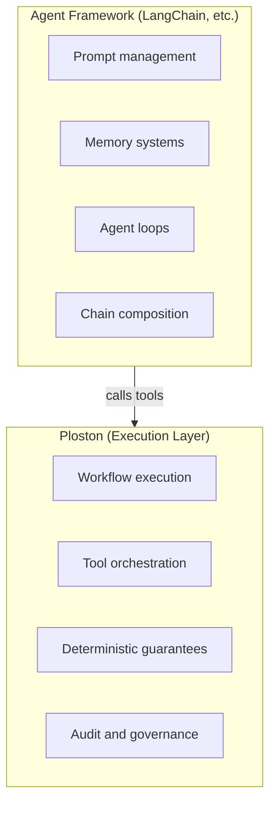

# Why Ploston?

Ploston exists because **agents shouldn't orchestrate their own execution**.

This page explains why—and how Ploston compares to alternatives.

---

## vs. Letting the Agent Orchestrate

The most common question: *"Why not just let Claude/GPT handle the tool calls directly?"*

### The Token Cost Problem

Every tool call in an agent loop costs tokens:

```
Step 1: Agent receives user request         (~100 tokens)
Step 2: Agent reasons about what to do      (~200 tokens)
Step 3: Agent calls tool #1                 (~50 tokens)
Step 4: Agent receives result #1            (~500 tokens)
Step 5: Agent reasons about result          (~200 tokens)
Step 6: Agent calls tool #2                 (~50 tokens)
Step 7: Agent receives result #2            (~500 tokens)
... and so on
```

A 5-step task easily costs 2,000-5,000 tokens. With Ploston:

```
Step 1: Agent receives user request         (~100 tokens)
Step 2: Agent calls workflow                (~50 tokens)
Step 3: Agent receives final result         (~200 tokens)

Total: ~350 tokens
```

**Token reduction: 75-90% on multi-step tasks.**

### The Reliability Problem

LLMs are probabilistic. Given the same input, they might:
- Take a different execution path
- Format tool parameters differently
- Hallucinate an extra step
- Forget context from earlier in the chain

This is fine for creative tasks. It's unacceptable for automation.

Ploston workflows are deterministic. Same inputs → same execution path → same outputs. You can write tests. You can make guarantees.

### The Debugging Problem

When an LLM-orchestrated task fails, you get:
- A blob of reasoning
- Maybe an error message
- No clear indication of which step failed
- No intermediate values

When a Ploston workflow fails, you get:
- Exact step that failed
- Full trace of all previous steps
- Input/output values at each step
- Structured error with error code

### Summary

| Concern | Agent Orchestrates | Ploston Orchestrates |
|---------|-------------------|------------------|
| Token cost | High, unpredictable | Low, predictable |
| Determinism | No | Yes |
| Testability | Difficult | Unit testable |
| Debugging | Painful | Structured traces |
| Retry logic | LLM decides | Configured, reliable |
| Audit trail | None | Complete |

---

## vs. Workflow Engines (Temporal, Airflow, Prefect)

*"Isn't Ploston just another workflow engine?"*

No. Ploston is **agent-native**. Traditional workflow engines aren't.

### The Protocol Gap

Temporal, Airflow, and Prefect don't speak MCP. To use them from an agent, you'd need to:

1. Build an MCP wrapper around the workflow engine
2. Handle the translation between MCP tool calls and workflow invocations
3. Map workflow outputs back to MCP responses
4. Build your own error handling layer

Ploston speaks MCP natively. Workflows automatically appear as MCP tools. No glue code.

### The Mental Model Gap

Traditional workflow engines are designed for:
- Scheduled batch jobs
- Long-running data pipelines
- Human-triggered processes

Ploston is designed for:
- Real-time agent requests
- Sub-second latency requirements
- Dynamic tool composition
- Multi-agent coordination

The execution model is different. Ploston workflows are invoked like function calls, not submitted like jobs.

### The Integration Gap

Traditional workflow engines require:
- Separate deployment infrastructure
- Worker processes
- Queue management
- State persistence backends

Ploston runs as a single process. Start it, connect your agent, done.

### When to Use What

| Use Case | Best Choice |
|----------|-------------|
| Nightly data pipeline | Airflow/Prefect |
| Long-running batch job | Temporal |
| Real-time agent tool calls | **Ploston** |
| Sub-second execution | **Ploston** |
| MCP-native integration | **Ploston** |

---

## vs. MCP Gateways / Proxies

*"Can't I just put a proxy in front of my MCP servers?"*

A proxy routes requests. Ploston **executes workflows**.

### What a Gateway Does



A gateway:
- Routes tool calls to the right server
- Adds authentication
- Logs requests
- Maybe rate limits

It doesn't understand what you're trying to accomplish. It just passes messages.

### What Ploston Does



Ploston:
- Executes multi-step workflows
- Handles retries and errors
- Transforms data between steps
- Validates inputs and outputs
- Produces audit trails

### The Composition Problem

With a gateway, if you want to scrape → transform → publish, the agent must:



Gateways don't compose tools. Ploston does.

---

## vs. Agent Frameworks (LangChain, CrewAI, AutoGen)

*"How is Ploston different from agent frameworks?"*

Agent frameworks help you **build agents**. Ploston is **infrastructure agents call**.

### The Layer Difference



Ploston doesn't replace your agent framework. It's what your framework's agents call when they need reliable execution.

### Complementary, Not Competing

You can use:
- LangChain for agent orchestration + Ploston for tool execution
- CrewAI for multi-agent coordination + Ploston for deterministic workflows
- AutoGen for conversations + Ploston for reliable actions

Ploston makes your agents more reliable, regardless of which framework you use.

---

## The Category

Ploston is not:
- ❌ An API gateway (we don't just route)
- ❌ A workflow engine (we're agent-native)
- ❌ An agent framework (we don't do planning)
- ❌ An MCP proxy (we add execution logic)

Ploston is:
- ✅ A deterministic execution layer for AI agents
- ✅ The infrastructure that makes agents production-ready
- ✅ The "Kubernetes moment" for agent systems

**[Get Started →](getting-started/installation.md)**
